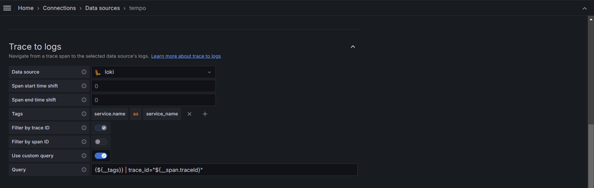

### intall ingress-nginx
```bash
helm upgrade --install ingress-nginx ingress-nginx \
  --repo https://kubernetes.github.io/ingress-nginx \
  --namespace ingress-nginx --create-namespace \
  -f nginx-controller-config.yaml
```
or
if ingress-nginx-controller already installed,
```bash
kubectl edit -n ingress-nginx configmap ingress-nginx-controller
```
```yaml
data:
  # log-level: "debug"
  enable-opentelemetry: "true"
  opentelemetry-operation-name: "HTTP $request_method $service_name $uri"
  opentelemetry-trust-incoming-span: "true"
  otlp-collector-host: "demo-collector.otel-test.svc"
  otlp-collector-port: "4317"
  # otel-max-queuesize: "2048"
  # otel-schedule-delay-millis: "5000"
  # otel-max-export-batch-size: "512"
  # otel-service-name: "nginx-proxy" # Opentelemetry resource name
  # otel-sampler: "AlwaysOn" # Also: AlwaysOff, TraceIdRatioBased
  # otel-sampler-ratio: "1.0"
  # otel-sampler-parent-based: "true"
...
```

### install Loki & Grafana
```bash
helm install --create-namespace -n monitoring -f values-loki.yaml loki grafana/loki
helm install --create-namespace -n monitoring grafana grafana/grafana
```

<details>


</details>


### install Tempo
```bash
helm install --create-namespace -n monitoring tempo grafana/tempo
```

<details>


</details>

### collocation between Loki & Tempo
- Loki -> Tempo


- Tempo -> Loki



### install chart
```bash
helm uninstall -n otel-test myrelease; helm install -n otel-test myrelease mychart/; watch 'kubectl get all -n otel-test';
```

### auto-instrument
#### cert-maanger
- cert-maanger: `kubectl apply -f https://github.com/cert-manager/cert-manager/releases/download/v1.15.2/cert-manager.yaml`

#### otel-operator
- otel-operator: `kubectl apply -f https://github.com/open-telemetry/opentelemetry-operator/releases/latest/download/opentelemetry-operator.yaml`

or 

- 
```bash
helm install opentelemetry-operator open-telemetry/opentelemetry-operator \
--set "manager.collectorImage.repository=otel/opentelemetry-collector-contrib" \    # contrib for collector prometheus exporter
--set admissionWebhooks.certManager.enabled=false \
--set admissionWebhooks.autoGenerateCert.enabled=true
```

```bash
helm uninstall opentelemetry-operator
```


### Reference
- [ingress-nginx official document: opentelemetry](https://kubernetes.github.io/ingress-nginx/user-guide/third-party-addons/opentelemetry/)
- [todo source (docker-compose)](https://github.com/habmic/opentelemetry-101)

- [Instrument for both nodejs & python](https://github.com/open-telemetry/opentelemetry-operator/blob/main/README.md#opentelemetry-auto-instrumentation-injection)

- [Collocate Your Metric, Log & Traces](https://youtu.be/qVITI34ZFuk?si=soPBhcc2sN5vxb61)
  - [Grafana Loki: Structured Metadata](https://grafana.com/docs/loki/latest/get-started/labels/structured-metadata/) : OpenTelemetry attributes are ⚠️Metadata⚠️ (not Label!!!)
  - [Grafana Tempo: Trace to Logs](https://grafana.com/docs/grafana/latest/datasources/tempo/configure-tempo-data-source/#trace-to-logs)